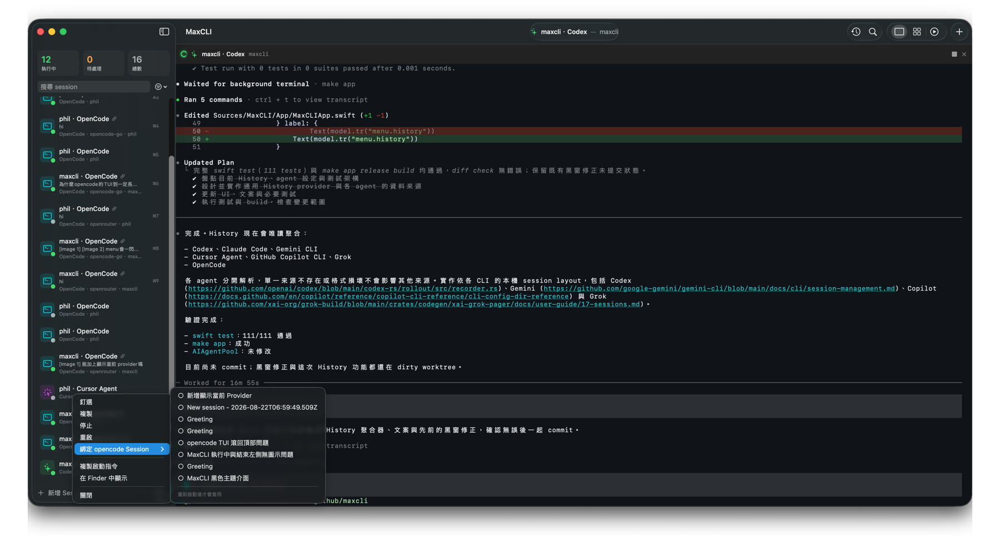
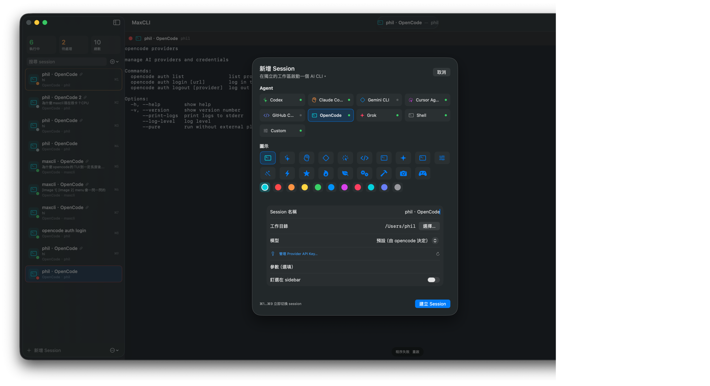

# MaxCLI

> macOS 上的多 agent CLI 控制台：在同一個視窗裡，同時操作、監看與恢復多個終端工作階段。

[](https://github.com/irons163/maxcli/releases/latest)
[](https://github.com/irons163/maxcli/releases/latest)



MaxCLI 是以 SwiftUI 製作的 macOS app。它把 Codex、Claude Code、Gemini CLI、OpenCode 等互動式工具放進真正的 PTY 終端；每個 session 都是獨立程序、工作目錄與啟動參數。你可以同時開十幾個 agent，快速知道誰正在執行、誰需要注意，以及下一步該接哪個工作。

## 為什麼使用 MaxCLI

- 同時執行多個 agent，不必在終端分頁之間來回尋找。
- 以 Focus、Grid、Active 三種工作區，在操作與總覽之間快速切換。
- 保留各個 CLI 的原生互動介面、登入狀態與 resume 能力。
- 聚合本機 History，從過去的對話找回 session，再綁定回目前的工作區。
- 純本機運作；MaxCLI 不上傳 terminal 內容，也不代替各 CLI 管理帳號。

## 工作區

| 模式 | 適合情境 |
| --- | --- |
| **Focus** | 專心操作目前選取的單一終端。 |
| **Grid** | 同時監看多個 session；雙擊 pane 會切回該 session 的 Focus。 |
| **Active** | 只顯示正在執行或有活動的 session，適合等待多個 agent 回應。 |

Active 模式會維持穩定的工作區順序；session 的輸出與背景提醒會反映在 sidebar，不會因為每個思考中的狀態事件而持續交換位置。

## 新增 Session



新增 session 時可以選擇 agent、工作目錄、模型或 provider、啟動參數、圖示與顏色，也可以釘選重要 session。除了內建 agent，還能使用一般 Shell 或輸入任意 Custom command。

## 支援的 CLI

MaxCLI 會從目前的 shell 環境尋找可執行檔；請先依照各工具的官方文件完成安裝與登入。

| Agent | 預設 executable |
| --- | --- |
| Codex | `codex` |
| Claude Code | `claude` |
| Gemini CLI | `gemini` |
| Cursor Agent | `agent` |
| GitHub Copilot CLI | `copilot` |
| OpenCode | `opencode` |
| Grok | `grok` |
| Shell | 目前使用者的 login shell |
| Custom | 自訂命令 |

## History 與 Resume

History 以唯讀方式聚合各工具保存在本機的 session transcript，目前支援：

- Codex
- Claude Code
- Gemini CLI
- Cursor Agent
- GitHub Copilot CLI
- Grok
- OpenCode

可以從 History 找到舊 session，再從 sidebar 將它綁定到對應的 agent session。重啟時，MaxCLI 會使用該 agent 的原生 resume 參數；找不到原始紀錄時，不會影響其他來源。

## 下載與安裝

前往 [Latest Releases](https://github.com/irons163/maxcli/releases/latest)，依照 Mac 的處理器下載：

- Apple Silicon：M1、M2、M3、M4 等 Mac
- Intel：Intel 處理器 Mac

開啟 DMG 後，將 `MaxCLI.app` 拖到 `Applications`。MaxCLI 內建 Sparkle，後續可在 app 內檢查更新。

需求：macOS 14 或以上。

## 鍵盤操作

| 快捷鍵 | 動作 |
| --- | --- |
| `⌘N` | 新增 session |
| `⌘K` | 快速搜尋並切換 session |
| `⌘1`…`⌘9` | 切到 sidebar 前九個 session |
| `⌘[` / `⌘]` | 上一個／下一個 session |
| `⌘D` | 複製目前 session |
| `⌘⇧R` | 重啟目前 session |
| `⌘⇧.` | 停止目前 session |
| `⌘⇧G` | Focus／Grid／Active 切換 |

## 從原始碼執行

需求：macOS 14+、Xcode 16+。

```sh
swift build
swift test
swift run MaxCLI
```

建立可以雙擊開啟的本機 app：

```sh
make app
open build/MaxCLI.app
```

執行 Sparkle appcast 測試：

```sh
make appcast-test
```

也可以直接用 Xcode 開啟 `Package.swift`。專案使用 [SwiftTerm](https://github.com/migueldeicaza/SwiftTerm) 提供 VT100／Xterm 與本機 pseudo-terminal 支援，並使用 [Sparkle](https://sparkle-project.org/) 提供 app 內更新。

## 權限與 release

MaxCLI 不啟用 App Sandbox，因為 child process 必須能存取你指定的 repository、登入 shell 的 CLI 與開發工具。正式 DMG 由 `.github/workflows/release-dmg.yml` 建立 arm64／Intel 套件、上傳 GitHub Release，並產生 Sparkle appcast。

正式 release workflow 需要設定以下 GitHub Actions secrets：

`APPLE_CERTIFICATE_P12_BASE64`、`APPLE_CERTIFICATE_PASSWORD`、`KEYCHAIN_PASSWORD`、`APPLE_TEAM_ID`、`APPLE_API_KEY_ID`、`APPLE_API_ISSUER_ID`、`APPLE_API_PRIVATE_KEY_BASE64`。

每次 release 也要同步更新 `Packaging/Info.plist` 的 `CFBundleShortVersionString` 與 `CFBundleVersion`。

## 多 session 使用建議

1. 用 repository 與任務命名，例如 `api · review`、`web · tests`，不要只叫 `Claude 1`。
2. 把長期主線釘選在最上方；前九個位置適合建立穩定的快捷鍵習慣。
3. 平時用 Focus，等待 agent 時切 Grid；需要集中處理有動靜的 session 時切 Active。
4. 同一個 repo 要平行處理時先 Duplicate，再更換名稱或 CLI；每個 session 仍是獨立程序。

更完整的互動與架構取捨請看 [docs/DESIGN.md](docs/DESIGN.md)。
